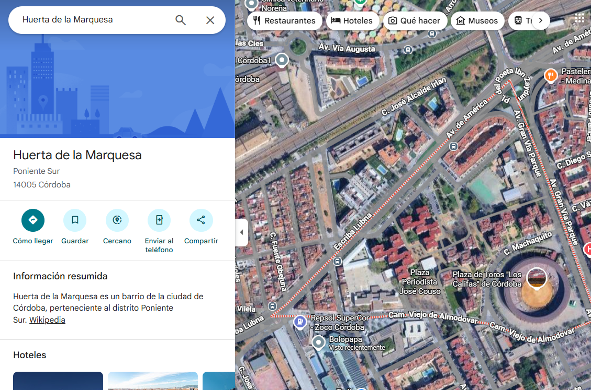
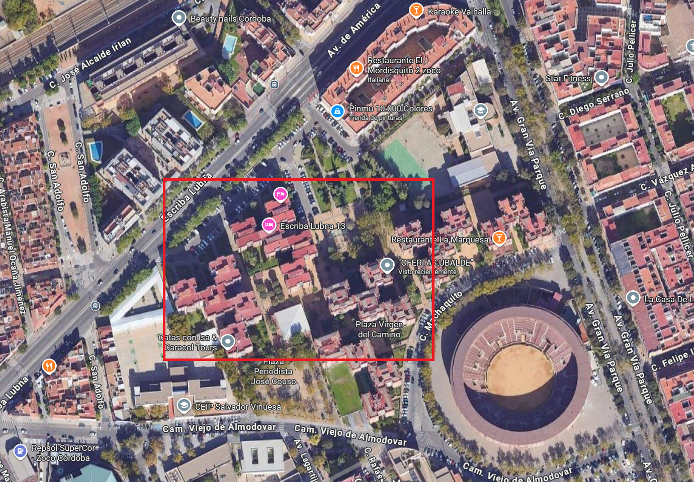
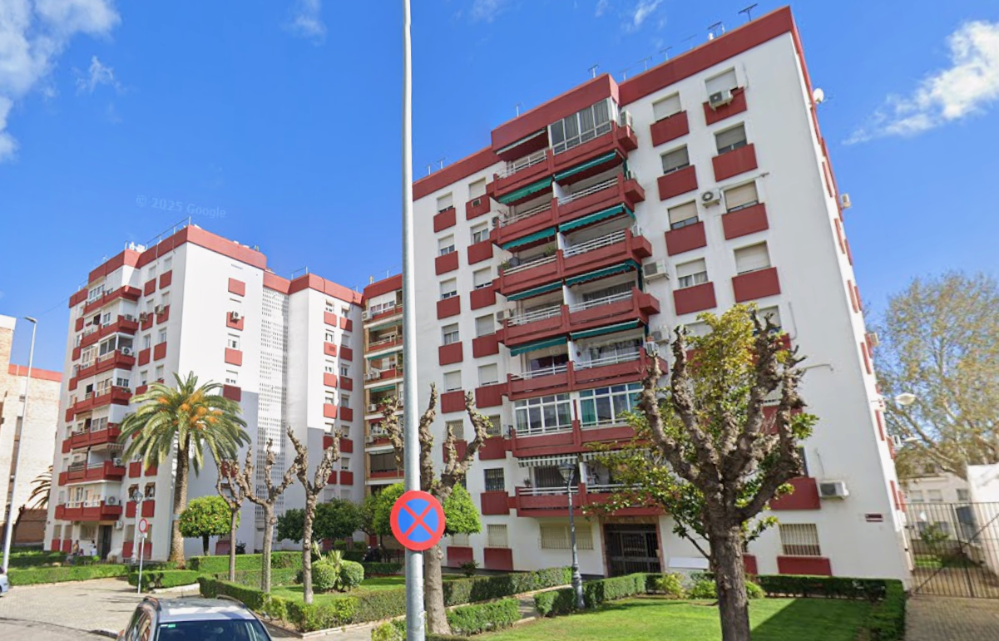
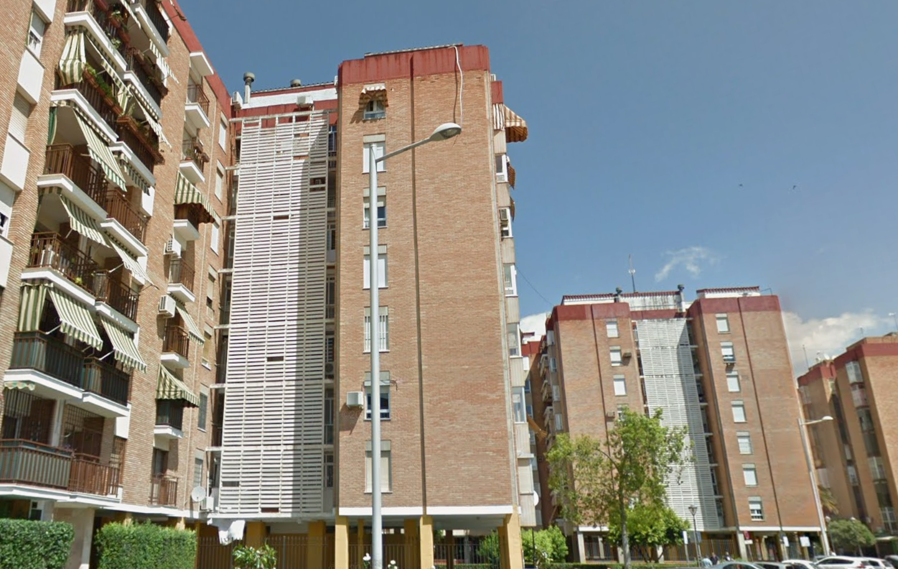
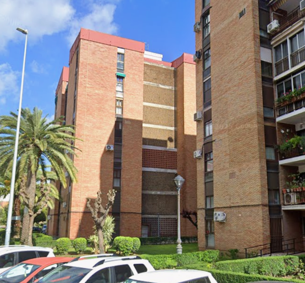
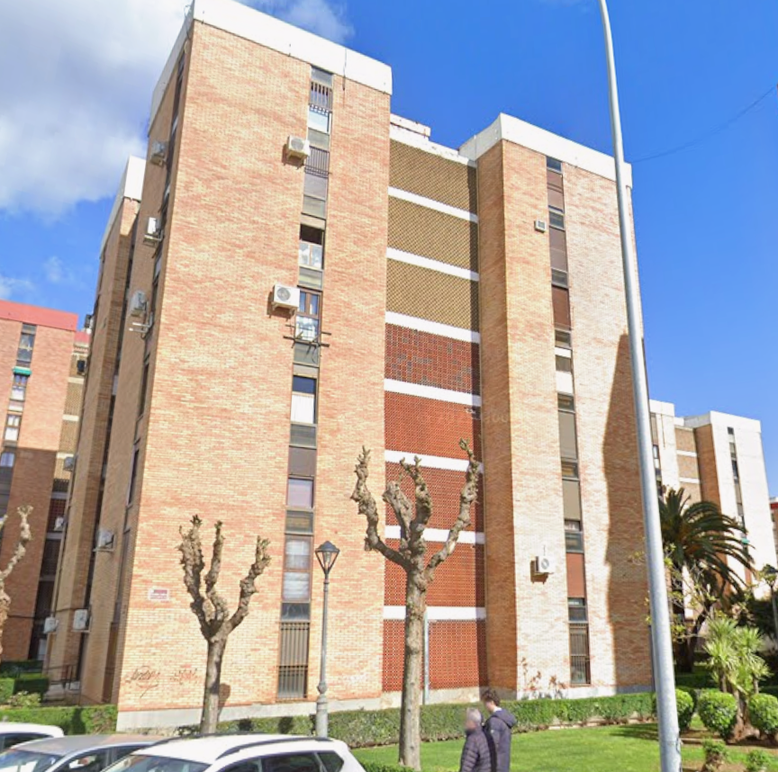
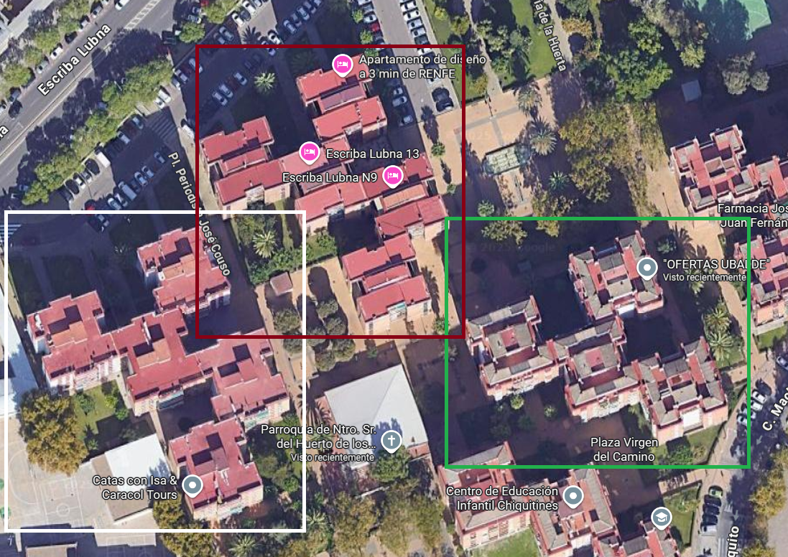
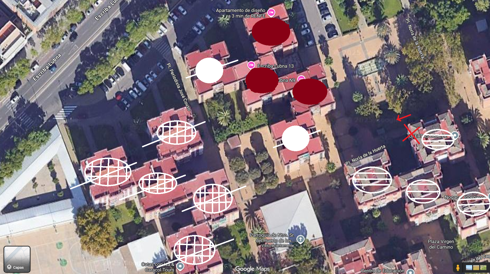
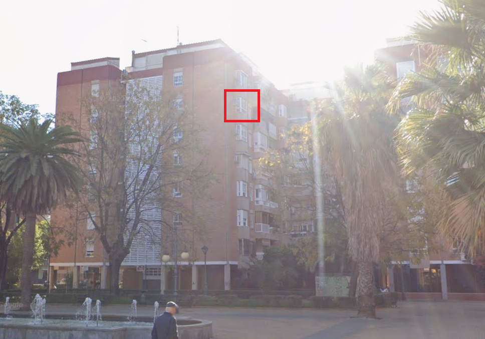

# El Reencuentro

> CTF Track Securiters - RootedCON 2026

> 27/02/2026 18:00 CEST - 01/03/2026 18:00 CEST

* Categoría: OSINT
* Autor: Kesero
* Dificultad: ★★☆
* Etiquetas: GEOSINT

## Descripción
    
    Después de más de 4 años sin vernos, hemos decidido escaparnos un fin de semana a Córdoba con nuestros amigos. 

    Tiene pinta de que va a ser un fin de semana inolvidable, sobre todo porque después de tanto tiempo por fin podemos echar el rato juntos como en los viejos tiempos.

    Victoria ya ha llegado al Airbnb situado en "Huerta de la Marquesa", pero es demasiado graciosa y en vez de pasarme la ubicación por WhatsApp como harían las personas normales, me ha pasado una foto de sus vistas por la ventana.

    El viaje me ha aturdido y necesito llegar lo antes posible.

    Formato de la flag: clctf{latitud,longitud,planta}.

    Si las coordenadas son -48.4705528,44.9939586 y es la 1ª planta, la flag será clctf{-48.4705,44.9939,1} (4 decimales sin redondeos).

## Archivos
    
    reencuentro.jpeg

## Resolución

En el enunciado se menciona el barrio designado en Córdoba llamado "Huerta de la Marquesa".

En dicha zona, se pueden observar una serie de bloques de pisos con forma de cruz.

A su vez, en la imagen proporcionada en el reto, se muestran bloques de pisos con una serie de rejas en el centro y con fachadas distintas.

Si realizamos un estudio del tipo de edificios mediante el uso de herramientas como Google Maps o Google Earth, podemos observar que se dividen en edificios con rejas horizontales, rejas verticales y rejas en forma de malla (con la fachada superior blanca y roja).

### Rejilla vertical

### Rejilla horizontal

### Rejilla Malla Roja

### Rejilla Malla Blanca

Siendo el color verde el correspondiente a los edificios con reja horizontal, el color blanco para los edificios designados con reja vertical y el color rojo para los edificios con reja en forma de malla, la zona desglosada es la siguiente:

En la imagen proporcionada por el reto, se observa la presencia de un edificio con reja de tipo vertical al fondo y un edificio con reja de malla (fachada color blanca) a la derecha. Esto nos indica que la foto fue tomada desde un edificio con reja horizontal.

Si se lleva a cabo la premisa anterior junto con la observación de la posición de los elementos en el entorno como las palmeras, árboles, farolas junto con sus marcas en el suelo, se puede llegar a la conclusión de que la ubicación final es la siguiente:

Para obtener el piso exacto del lugar, se visualizan los ventanales en el edificio de la izquierda. Con ello se llega a la conclusión de que la foto fue tomada en un sexto piso.

> **flag: clctf{37.8828,-4.7963,6}**