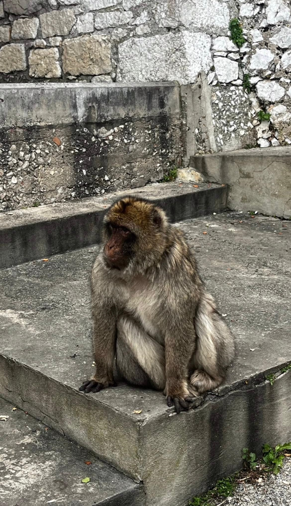
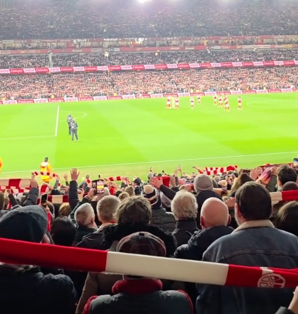
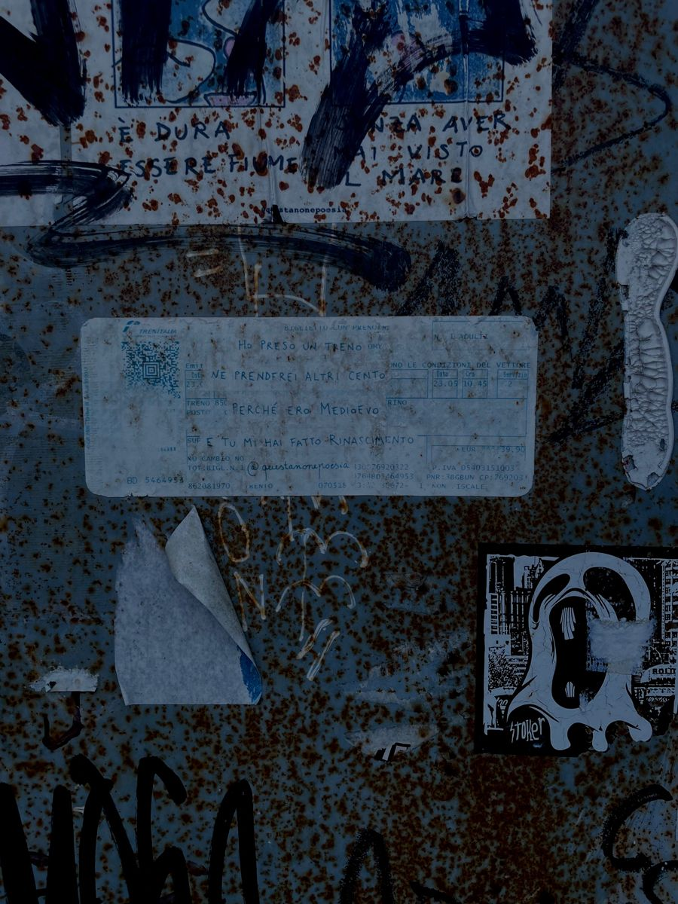
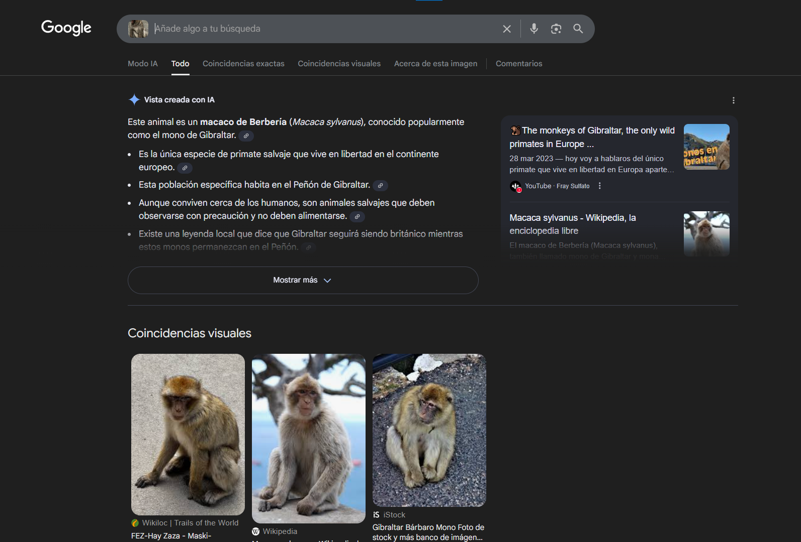
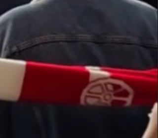
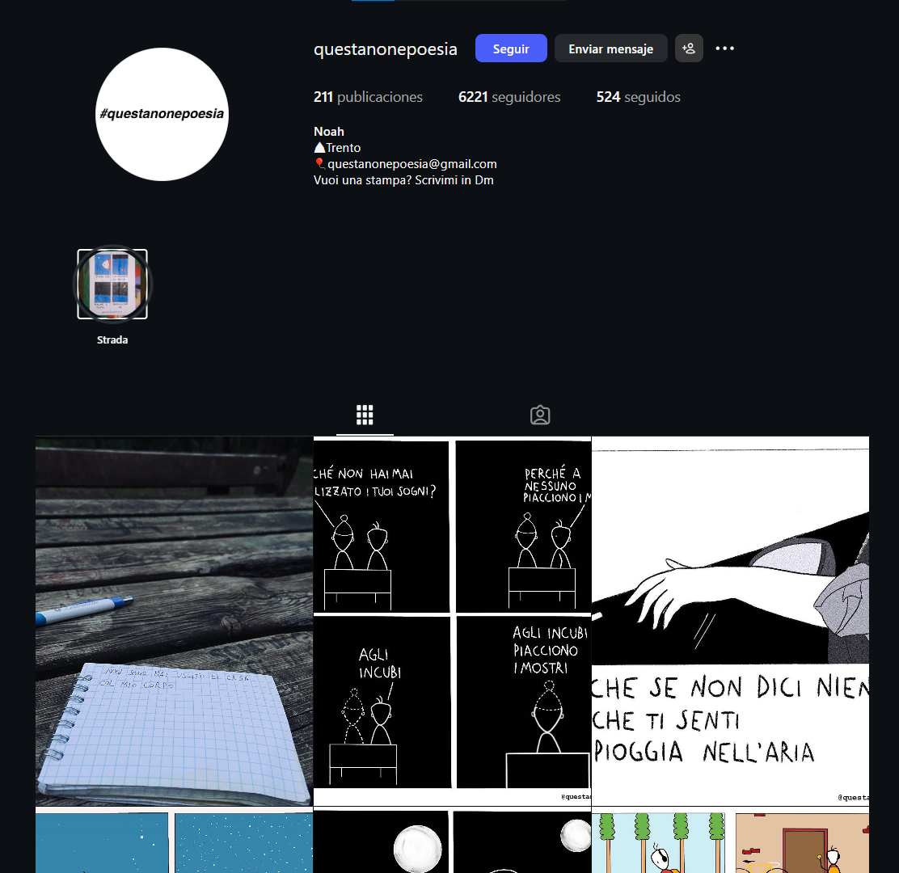
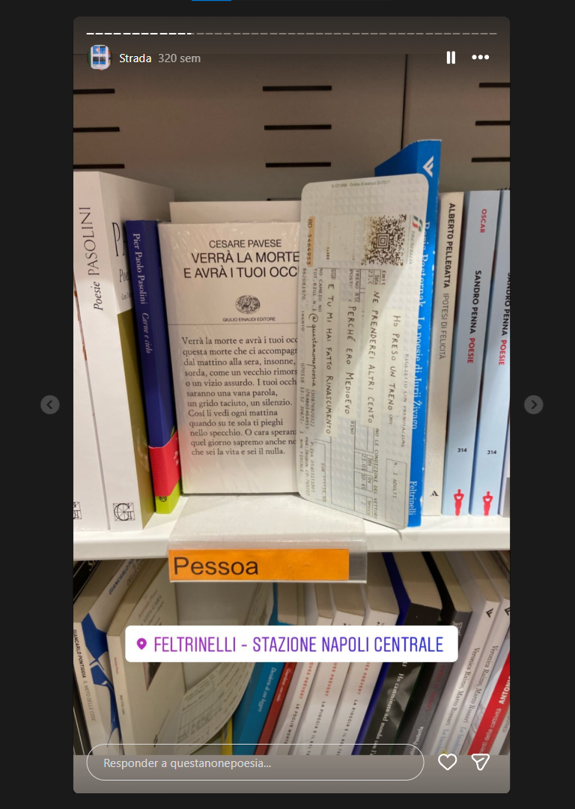

# La Despedida

> CTF Track Securiters - RootedCON 2026

> 27/02/2026 18:00 CEST - 01/03/2026 18:00 CEST

* Categoría: OSINT
* Autor: Kesero
* Dificultad: ★☆
* Etiquetas: OSINT de imágenes

## Descripción
    
    Todo lo bueno llega a su fin. Tras un fin de semana inolvidable, es hora de volver a la realidad.

    Como parte de un pequeño juego de despedida, hemos decidido mantener nuestro destino en secreto. No hay billetes de avión ni ubicaciones compartidas; solo nos hemos repartido unas imágenes peculiares de nuestra ciudad de procedencia.

    Como buen investigador, tengo que saber a qué ciudad irán mis amigos.

    Formato de la flag: clctf{FotoPablo,FotoDavid,FotoVictoria}.

    Si los lugares son Tokyo para Pablo, Santiago de Compostela para David y Berlín para Victoria, la flag será clctf{Tokyo,Santiago_de_Compostela,Berlín}.

## Archivos
    
    Pablo.png

    David.jpg

    Victoria.jpg

## Resolución
### Ubicación Pablo

Con una simple búsqueda en Google, se obtiene que el babuino mostrado en la imagen es autóctono de la zona de Gibraltar.

### Ubicación David

En la imagen proporcionada se encuentra en un estadio de fútbol. Se observa a una afición liderada por colores blancos y rojos.

Si se observa el extremo derecho de la bufanda de un aficionado, se obtiene parte del escudo de la afición.

Si se busca por escudos de equipos de fútbol con patrones similares en Google, se llega a la conclusión de que la bufanda procede del merchandising del Arsenal FC.

Debido a la dominancia del color blanco y rojo sobre la grada, se llega a la conclusión de que el estadio de fútbol en cuestión es el llamado Emirates Stadium, estadio oficial del Arsenal ubicado en Londres. 

### Ubicación Victoria

En el billete de tren mostrado en la imagen se observa un nombre de usuario perteneciente a una cuenta llamada "@questanonepoesia".

Si se busca en Google por dicho usuario, se obtiene la cuenta oficial tanto en Tumblr como en Instagram:

Si se observan sus publicaciones en Instagram, precisamente el apartado de "historias destacadas", se obtiene una historia en la que se muestra el billete de tren antes de ser colocado.

Para comprobar que es el mismo billete, solo basta con comparar ambos identificadores para darse cuenta de que se corresponde con el mismo billete en cuestión.

Además, en la imagen se muestra que el billete se encuentra en una estación en Nápoles.

> **flag: clctf{Gibraltar,Londres,Nápoles}**