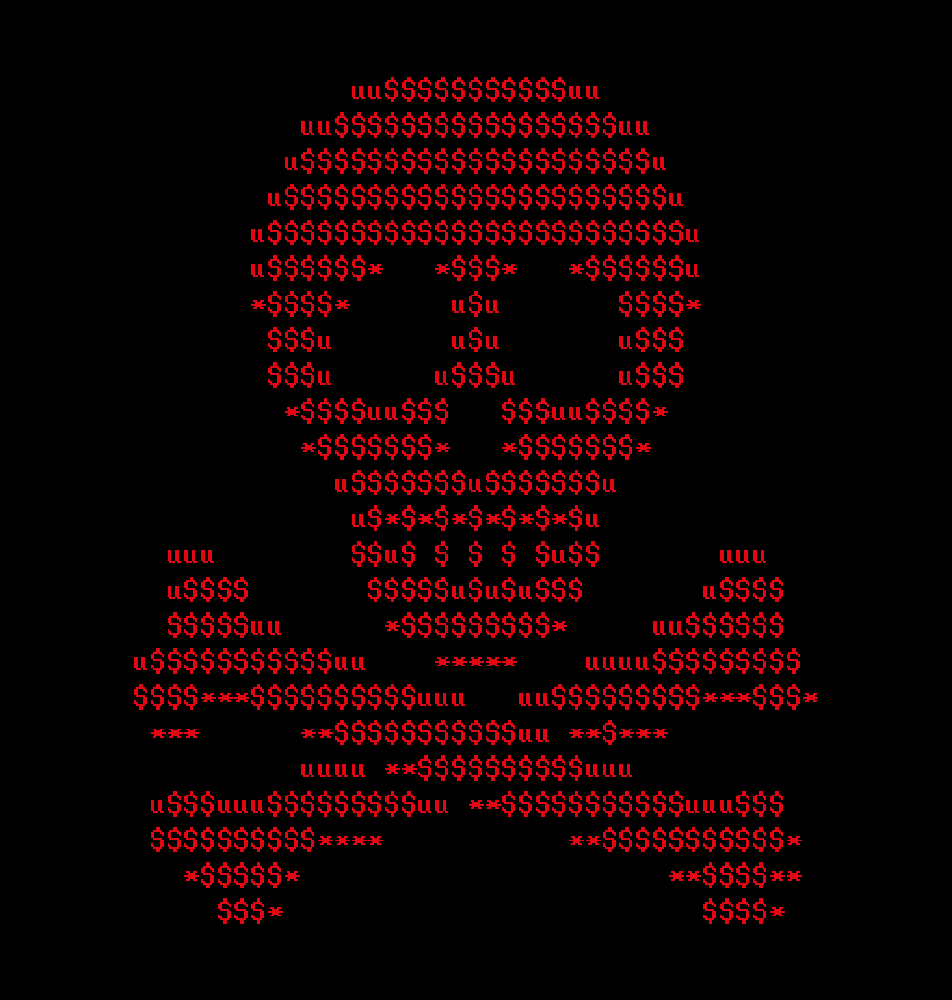

# Ransomware Hospital
<p align="center">
  
</p>

<p align="center">
  
  
</p>

## Contenido

```
├── assets
│   ├── pwned.png
│   └── skull.png
├── ransom.py
├── README.md
├── requirements.txt
└── src
    ├── decrypt.py
    ├── encrypt.py
    ├── __init__.py
    └── prompt.py
```

---

## Estructura

### `ransom.py`
Archivo principal de ejecución.

### `src/encrypt.py`
Contiene la lógica de cifrado de archivos.

### `src/decrypt.py`
Contiene la lógica de descifrado. (Me la reservo para mí junto con las claves)

### `src/prompt.py`
Nota de rescate.


##  Instalación

### Clonar proyecto

```sh
git clone http://challs.caliphallabs.com:18971/louden/ransomware-hospital
```

### Instalar dependencias:

```sh
pip install -r requirements.txt
```

---

## Uso

```sh
python3 ransom.py
```