# Ransomware Hospital 2

> CTF Track Securiters - RootedCON 2026

> 27/02/2026 18:00 CEST - 01/03/2026 18:00 CEST

* Categoría: Research
* Autor: Kesero
* Dificultad: ★★☆
* Etiquetas: Ciberinteligencia, Investigación

## Descripción
    
    El Hospital Aguilera ha sido víctima de un ataque de ransomware a gran escala. Todavía no se sabe el alcance exacto del ciberataque, pero se confirma que ha comprometido archivos médicos críticos de los pacientes de todo el hospital.

    Como analista del equipo, debes apoyar al CISO (Adrián Jiménez) en la respuesta técnica al incidente. Se te ha facilitado un volcado de los correos corporativos enviados el día del ciberataque junto con el flujo de información interna generado tras detectar la intrusión.

    En este caso, deberás desenmascarar al atacante consiguiendo su nombre completo. Necesitamos acabar con esto cuanto antes.

    En situaciones de crisis, la diferencia entre el éxito y el desastre radica en la capacidad de mantener la calma e hilar fino. La vida de los pacientes depende de conseguirlo.

    http://gmail.challs.caliphallabs.com


## Archivos
    
    http://gmail.challs.caliphallabs.com


## Introducción

Esta serie de retos ha sido diseñada con fines estrictamente educativos para simular un escenario de ciberataque realista en un entorno controlado. El objetivo es entrenar capacidades de análisis, respuesta ante incidentes y ciberinteligencia. En ningún caso se pretende incentivar o promover conductas ilícitas, ni el uso de estas técnicas fuera de un marco ético y legal.

En este caso, se plantea un ataque de ransomware al Hospital Aguilera, en el que un atacante ha accedido al servidor de radiografías gracias a un ataque de phishing dirigido al Doctor García.

## Gmail


En el apartado de `gmail`, se encuentran varios correos corporativos pertenecientes a Adrián Jiménez, actual CISO, que tuvieron lugar el día del ciberataque.

Entre ellos se encuentran correos de LinkedIn, correos reenviados de Óscar sobre el phishing introducido al Doctor García, un correo de Óscar avisando al CISO sobre el ciberataque acontecido y por último, un correo de extorsión por parte del atacante llamado "Louden" 

### Phishing Doctor García

En los correos reenviados de Óscar sobre el phishing, podemos observar cómo el ciberdelincuente obtuvo acceso al sistema mediante la suplantación de Óscar, generando urgencia en el doctor por una supuesta "brecha de seguridad".


Si nos damos cuenta, la dirección de correo electrónico es falsa, debido a que la original se presenta como `@aguilerahospital.com`. En cambio, el presentado en dicho correo pertenece a `@aguilerahosp1tal.com`. Un cambio sutil que se hace poco perceptible debido a la gravedad de la situación.

El Doctor García asistió a dicha reunión y a partir de ese momento, sus credenciales fueron cambiadas.


### Correos LinkedIn

En estos correos no hay información útil. Simplemente se trata de correos de "relleno" hacia Adrián Jiménez. A su vez, hay un pequeño guiño sobre el LinkedIn corporativo de "Caliphal Labs"


### Correo aviso Óscar

En este correo se presenta el informe de lo sucedido al CISO. En él se informa sobre la situación del hospital y las contingencias realizadas, otorgando el archivo `Evidence.zip` perteneciente a un volcado del ordenador del Doctor García.


### Correo extorsión Louden

En última instancia, se presenta un correo de extorsión procedente del usuario Louden el cual informa de que los archivos médicos del hospital han sido cifrados. Además exige un rescate por la información e insta a la negociación tanto de la información como de la clave de recuperación.

Para ello, publica una URL .onion junto a un código de invitación al chat privado de negociación.


## Chat privado en Dark Web

En el correo anterior se proporciona un código de invitación a un chat en la Dark Web para la negociación con el cibercriminal.

Para acceder a él, necesitamos conectarnos mediante un servicio de Tor. Al acceder a dicha página se visualiza lo siguiente:

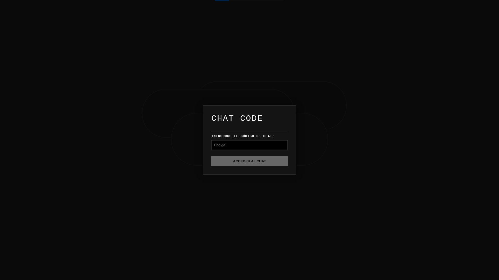

Al introducir el código `LOU-HOSP-8821`, se accede a un chat privado con el cibercriminal Louden.
En él, se puede observar la negociación entre Óscar y Louden. Se puede observar el tono burlesco continuo de Louden hacia la compañía y hacia el propio Óscar.

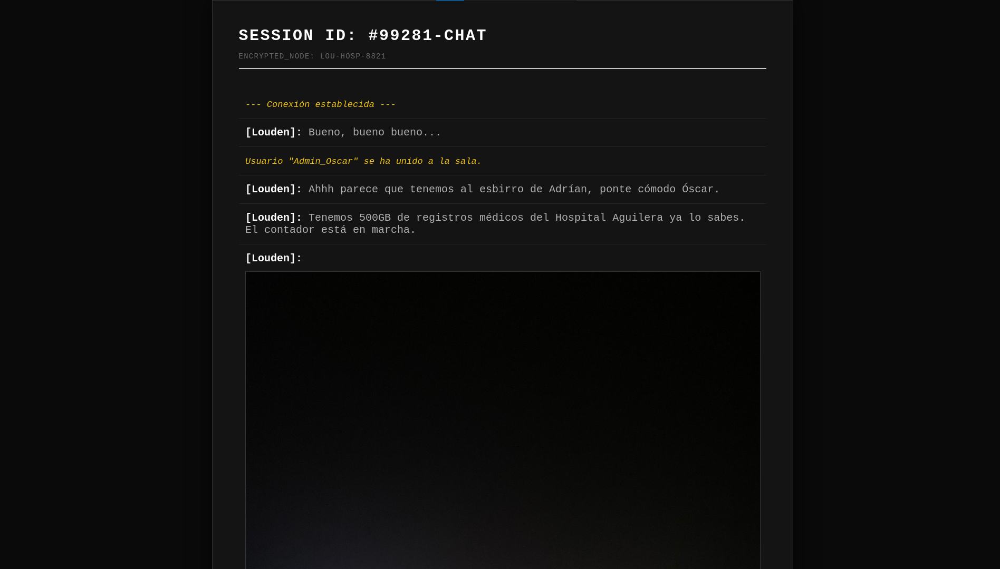

Además, Louden comenta que ha puesto un contador para ofrecer más urgencia sobre la negociación

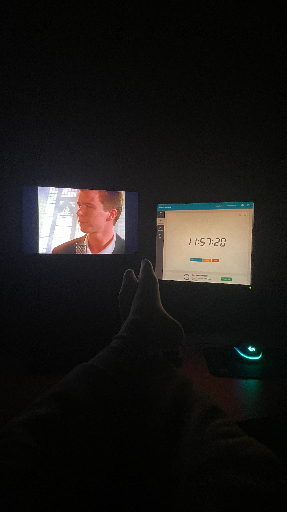

A continuación, Óscar le pide una prueba de los datos y Louden le ofrece parte del directorio y una serie de archivos de prueba de su interior.

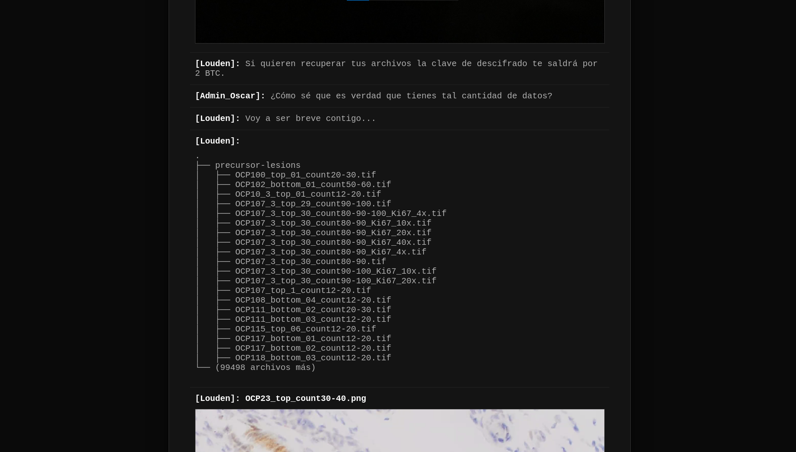
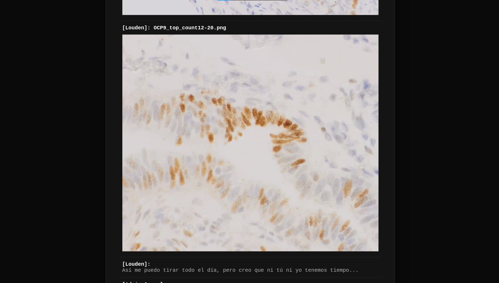

Llegados a este punto, Óscar se da cuenta de que la magnitud del ciberataque no es tan alta como se pensaba. Louden no ha conseguido obtener 500 GB de datos como se planteaba, solo ha conseguido secuestrar los datos con los que el Doctor García estaba tratando.

Es por ello que su último mensaje en el chat es la afirmación de que no le van a pagar la cifra que Louden busca.

En este punto Louden pierde los papeles e insiste nuevamente, generando urgencia y afirma que están interesados en los datos médicos.

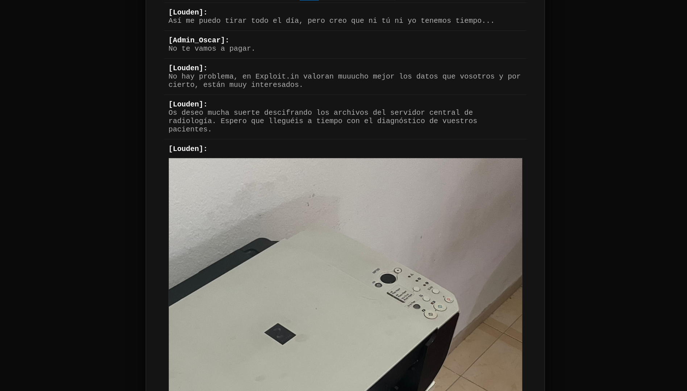

En última instancia, Louden envía una imagen un tanto peculiar, riéndose de Óscar.

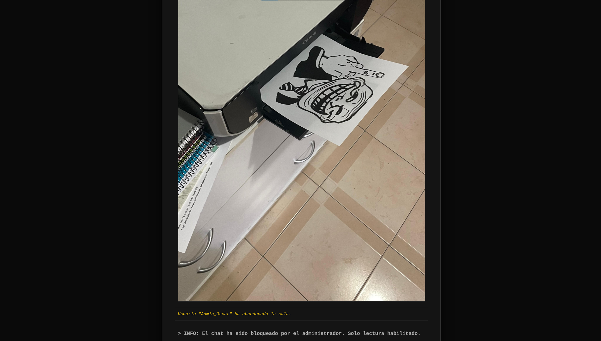

Lo que Louden no percibe es que en la esquina inferior izquierda, se filtra una referencia a una noticia perteneciente a un periódico en el que se lee:

```
Para leer la noticia completa consulta: http://newspaper.challs.caliphallabs.com/exclusiva/feudal-cats
```

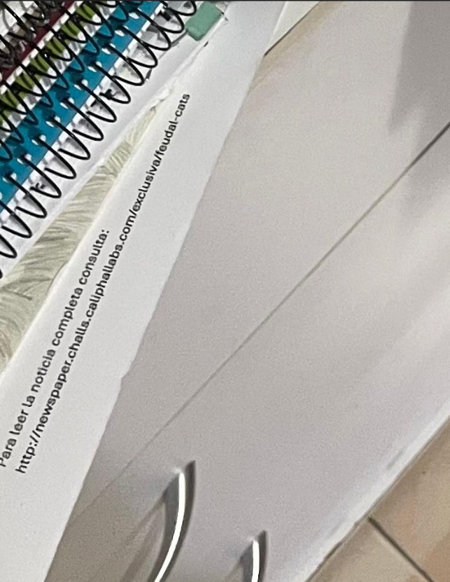


## Noticia Feudal Cats en Crónicas del Susurro

Entrando al enlace filtrado, se encuentra un periódico digital llamado "La Crónica del Susurro".

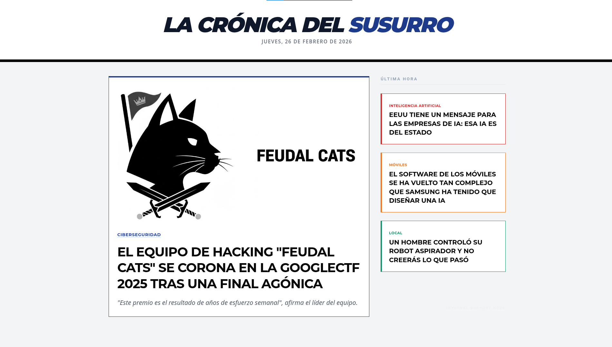

Haciendo clic al enlace de la noticia "Feudal Cats alcanza el subcampeonato mundial en la GoogleCTF2025", aparece lo siguiente:

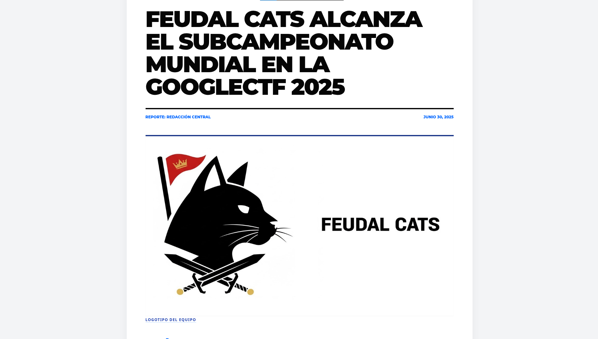
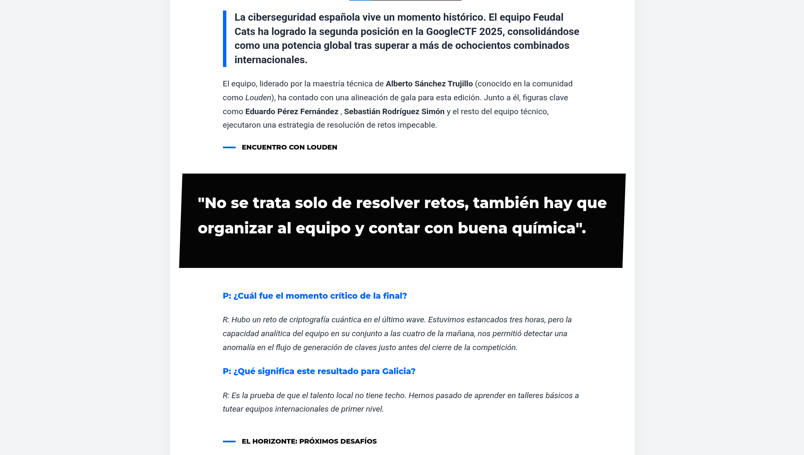
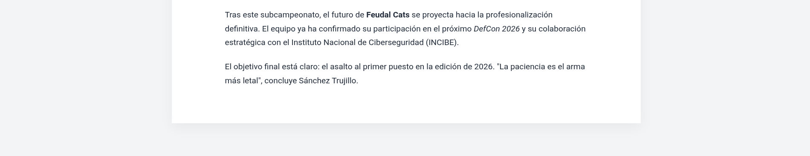

En la noticia se narra que el equipo de CTF conocido como "Feudal Cats" ha conseguido el subcampeonato en la GoogleCTF2025. A su vez, se hace una entrevista a Alberto Sánchez Trujillo, más conocido en el mundillo como Louden y narra los acontecimientos vividos.

En este punto tenemos un cruce de información y tal y como se narra en la noticia, se puede asegurar que Alberto Sánchez Trujillo es el nombre completo de su pseudónimo Louden.

> **flag: clctf{Alberto_Sánchez_Trujillo}**