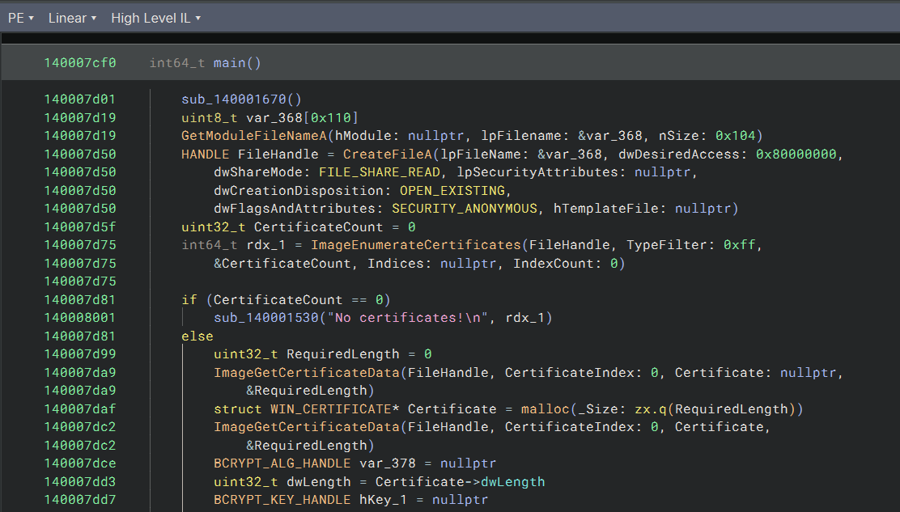
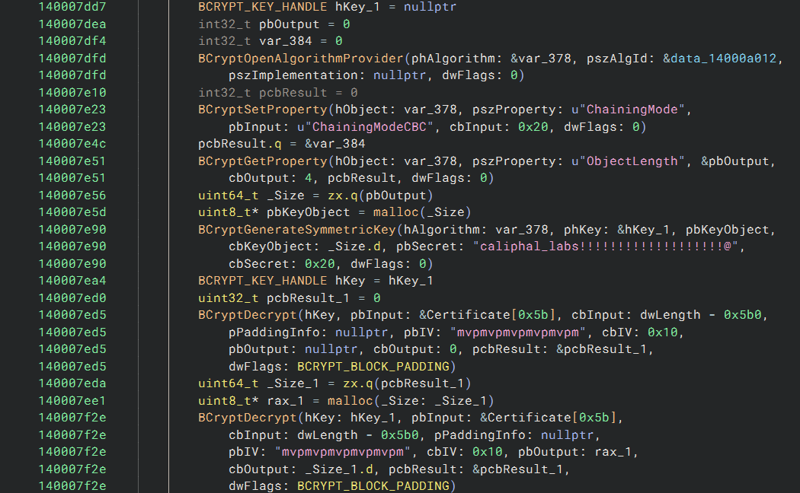
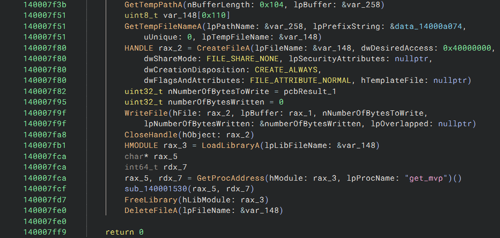
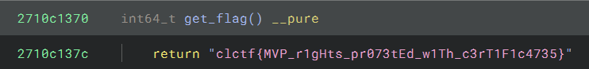

# MVP

> CTF Track Securiters - RootedCON 2026

> 27/02/2026 18:00 CEST - 01/03/2026 18:00 CEST

* Categoría: Reversing
* Autor: Daysa
* Dificultad: ★
* Etiquetas: PE32+, Certificados

## Descripción
    
    Como empresa, nos aconsejaron lanzar cuanto antes un Producto Mínimo Viable (MVP). No estamos del todo convencidos, pero bueno, así son las cosas cuando uno se adentra en estos mundos. Eso sí, nos preocupa mucho que alguien robe nuestra idea, así que la hemos censurado.

## Archivos
    
    mvp.exe

```
Binario PE32+
```

## Resolución

Se presenta un binario .exe en formato PE32+ (x86-64) para Windows. Al ejecutarlo se puede ver un mensaje que indica ```Censurado. © 2026 Caliphal Labs - Todos los derechos reservados.```.

### Análisis estático del binario

Abriéndolo en el descompilador como Binary Ninja, en la función main, se pueden observar las siguientes funciones:



Se enumera el número de certificados utilizando la función ```ImageEnumerateCertificates``` y, en caso de que exista alguno, se extrae tanto el tamaño como el contenido del mismo con la función ```ImageGetCertificateData```.

Un certificado de un binario es un sistema de firmado de código de Windows (conocido como Authenticode) para indicar quién firmó el ejecutable y comprobar que el fichero no ha sido modificado.

Tras esto, se prepara un sistema de cifrado AES-CBC con clave e IV hardcodeados, que parece descifrar una parte del contenido del certificado, a partir del byte ```0x5b0```.



La clave se puede encontrar en la función ```BCryptGenerateSymmetricKey```: ```caliphal_labs!!!!!!!!!!!!!!!!!!!@```. Sin embargo, midiendo la longitud de la misma, se puede ver que tiene una longitud de 33 bytes, frente a los 32 que debería tener. Este indicio puede indicar que el carácter @ del final es un error de descompilación. El vector inicializador, por otro lado, presente en la función ```BCryptDecrypt```, tiene la longitud correcta de 16 bytes: ```mvpmvpmvpmvpmvpm```.

La parte del certificado descifrada se guarda en el disco como archivo temporal y es llamado por la función ```LoadLibraryA```, encargada de cargar librerías DLL. Por tanto, se puede asumir que el certificado contiene una librería DLL maliciosa, de la que se llama la función ```get_mvp()```.



### Extracción del certificado y descifrado

Una vez identificados los ingredientes se procede a la extracción del certificado del binario. Se puede hacer de distintas maneras, siendo la más intuitiva hacer uso de la Windows API y la función ```ImageGetCertificateData```, igual que hace el binario original. 

Para facilitar el posterior descifrado también se puede implementar en Python. Tras el descifrado, se escribe en disco la librería DLL resultado, y descompilándola se recupera la flag en una función oculta ```get_flag()```:



```python
import struct
from Crypto.Cipher import AES


with open('mvp.exe', 'rb') as f:
    pe_data = f.read()

dos_header = pe_data[:64]

e_lfanew = struct.unpack('<I', dos_header[0x3c:0x40])[0]

cert_table_offset = e_lfanew + 24 + 112 + 32

cert_rva = struct.unpack('<I', pe_data[cert_table_offset:cert_table_offset+4])[0]
cert_size = struct.unpack('<I', pe_data[cert_table_offset+4:cert_table_offset+8])[0]

certificate = pe_data[cert_rva:cert_rva+cert_size]

dll = certificate[0x5b0:]

cipher = AES.new(b'caliphal_labs!!!!!!!!!!!!!!!!!!!', AES.MODE_CBC, b'mvpmvpmvpmvpmvpm')
dll = cipher.decrypt(dll)

with open('dll.dll', 'wb') as file:
    file.write(dll)
```

> **flag: clctf{MVP_r1gHts_pr073tEd_w1Th_c3rT1F1c4735}**