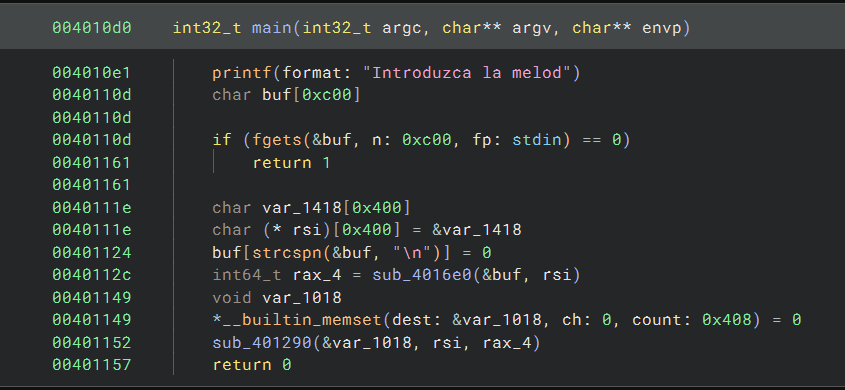
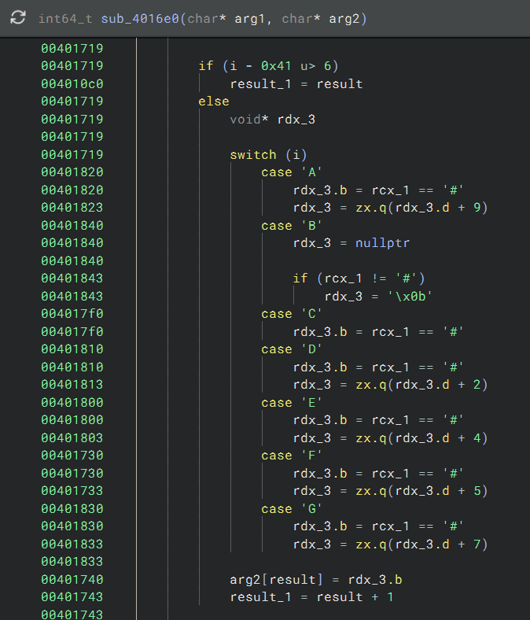
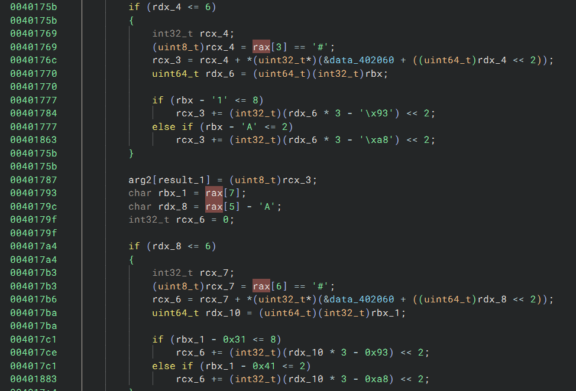
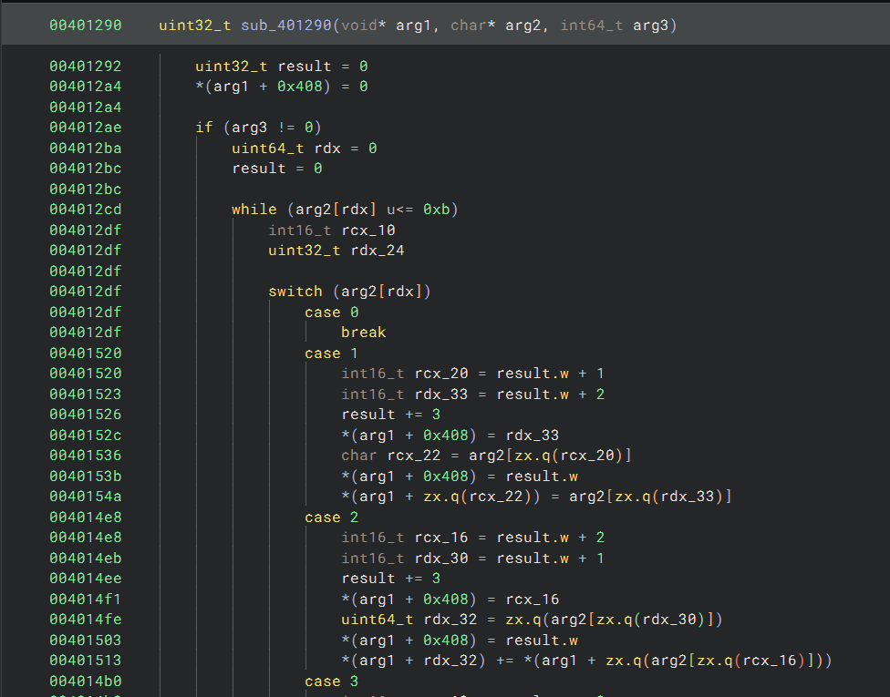

# Ninth Symphony in F(lag) major

> CTF Track Securiters - RootedCON 2026

> 27/02/2026 18:00 CEST - 01/03/2026 18:00 CEST

* Categoría: Reversing
* Autor: Daysa
* Dificultad: ★★★★
* Etiquetas: Ofuscación VM

## Descripción
    
    ¿Alguna vez habéis pensado cómo suena una reverse shell? ¿Y un echo? ¿No? ¿Estoy solo en esto? Bueno... ahora lo vais a descubrir.

    Nota: La flag se encuentra en /flag.txt.

## Archivos
    
    ninth_symphony

```
Binario ELF
```

## Resolución

Se presenta un binario ELF que, al ejecutarse, nos pide una melodía. Aparentemente, introduzcamos lo que introduzcamos, no devuelve nada. Además, tenemos una conexión por netcat del binario en remoto. Nos indican que la flag está en /flag.txt del servidor remoto.

### Análisis estático del binario

En la función ```main``` se encuentran las siguientes funciones:



Hay dos funciones relevantes: ```sub_4016e0``` y ```sub_401290```. La primera recibe la entrada del usuario, la transforma y la carga en ```rsi```. En la segunda está toda la lógica de ejecución de lo que parece ser una VM.

#### Transformación de la entrada del usuario



Al inicio de la función ```sub_4016e0``` se puede observar que toma de nueve en nueve bytes la entrada del usuario. Estos nueve bytes los divide en tres bloques de tres bytes cada uno. Para entender las transformaciones que realiza es importante identificar el rol de cada uno de las variables que se ven en la descompilación:

- ```rax```: funciona como un puntero a ocho bytes de la entrada que se está procesando (un conjunto de nueve bytes, exceptuando el primero).
- ```arg2```: es la variable sobre la que se van guardando los bytes tras las transformaciones.
- ```result```: va incrementando y representa la longitud de ```arg2```.

En la captura de pantalla anterior, ```rcx_1``` apunta al primer valor de ```rax```, por lo que se está trabajando con el segundo byte de cada conjunto de nueve. El primero está almacenado en ```i```, argumento del switch.

```i```, según nuestro switch, puede tomar valores de la A a la G, y ```rcx_1``` suma uno al contador ```rdx_3``` si ```rcx_1 == '#'```.

Todo esto recuerda al sistema de notación musical anglosajón, que representa las notas musicales con letras de la A a la G, seguidas de sostenidos, bemoles y un número que indica la octava. De hecho, siendo el Do (C) la primera nota, ```rdx_3 = 0``` si  ```i = 'C'```, ```rdx_3 = 1``` si  ```i = 'C'``` y ```rcx_1 == '#'```... De esta manera:

```
C = 0 C# = 1
D = 2 D# = 3
E = 4 E# = 5
F = 5 F# = 6
G = 7 G# = 8
A = 9 A# = 10
B = 11 B# = 0
```

El tercer byte de cada bloque, el correspondiente a la octava, se ignora, no se hace ninguna operación con él.

Según la relación anteriormente explicada, se guarda el byte resultado, que tendrá valores entre 0 y 12, en ```arg2``` y se continúa trabajando con los siguientes tres bytes.



Para los siguientes dos bloques de tres bytes se hace una misma operación. Es una transformación de notación musical a byte con valores de 0 a 130.

Primero se normaliza la entrada. Si el primer byte es una A, se pone un cero, si es una B un uno... así hasta la G. Nótese que es un punto de partida diferente que los tres bytes anteriores, ya que en el grupo anterior de tres bytes se empezaba a contar desde la C.

Después se considera la alteración. Si hay un sostenido (#) en el segundo byte, se suma uno al contador.

Y por último, se multiplica por la octava. En este caso sí afecta ese tercer byte que en bloque anterior no se consideraba, funciona como un multiplicador.

Por ejemplo, si el grupo de tres bytes en esta posición es C#3, primero se tomaría la C, que equivale a tres, se suma el sostenido (3 + 1 = 4) y se suman 12 notas por cada una de las octavas completas (4 + 12 * (3 - 1 escala incompleta) = 28). El byte que se añade a ```arg2``` sería el byte 28.

Se puede utilizar un script como el siguiente para calcular, dado un byte, su representación en esta notación:

```python
def reverse_calculate_arg(number):
    sem = number % 12
    oct_val = number // 12

    sem_to_note_acc = {
        0: ('A','-'),
        1: ('A','#'),
        2: ('B','-'),
        3: ('C','-'),
        4: ('C','#'),
        5: ('D','-'),
        6: ('D','#'),
        7: ('E','-'),
        8: ('F','-'),
        9: ('F','#'),
        10: ('G','-'),
        11: ('G','#')
    }

    n, acc = sem_to_note_acc[sem]

    if 0 <= oct_val <= 8:
        oct_char = str(oct_val + 1)
    else:
        oct_char = chr(ord('A') + (oct_val - 9))

    return n + acc + oct_char
```

#### Dispatcher de la VM

Una vez entendidas las transformaciones explicadas anteriormente se ha superado el proceso de análisis más complejo del reto. La función ```sub_401290``` es un simple dispatcher de un reto de reversing de ofuscación utilizando VMs. Lo único que tiene especial es que ofrece la opción de utilizar dos syscalls: un ```fopen``` y un ```putchar```.



### Construyendo el bytecode

El objetivo para conseguir la flag es construir un bytecode, utilizando la notación personalizada del reto, que abra el archivo /flag.txt y lo muestre por pantalla.

Se puede empezar por tratar de construir una intrucción ```mov r0 '0'```. La intrucción ```mov``` es el caso 0x01 de la VM, por lo que se representa por el primer bloque C#1. Se utiliza el número 1 por simplificar, valdría cualquier número, aunque es obligatorio poner alguno para no perder el alineamiento. El registro ```r0``` se representa con un 0x00, que en la notación, sería A-1 (A- = 0, de la primera octava). Por último, para el carácter ```0```, se utiliza la función ```reverse_calculate_arg(ord('0'))```. El resultado es A-5. Por tanto:

```
mov r0 '0' → C#1A-1A-5
```

La estrategia es la siguiente:

1. Escribir ```/flag.txt\0``` en memoria:
   - ```mov r0 '/'```
   - ```mov r1 0```
   - ```store r0 r1```
   - ```mov r0 'f'```
   - ```mov r1 1```
   - ```store r0 r1```
    ...

2. Leer el fichero tomando de la memoria el nombre:
   - ```mov r0, 1```
   - ```mov r1, 0```
   - ```syscall r0, r1```
    La syscall 1 es la referente al ```fopen```.

3. Utilizar la syscall ```putchar``` para imprimir carácter a carácter:
   - ```mov r0, 0```
   - ```load r0, r1```
   - ```mov r2, 2```
   - ```syscall r2, r0```
   - ```mov r0, 1```
   - ```load r0, r1```
   - ```mov r2, 2```
   - ```syscall r2, r0```
    ...

En el siguiente script se puede ver en detalle como se construye cada instrucción con la notación buscada:

```python
from pwn import *


def reverse_calculate_arg(number):
    sem = number % 12
    oct_val = number // 12

    sem_to_note_acc = {
        0: ('A','-'),
        1: ('A','#'),
        2: ('B','-'),
        3: ('C','-'),
        4: ('C','#'),
        5: ('D','-'),
        6: ('D','#'),
        7: ('E','-'),
        8: ('F','-'),
        9: ('F','#'),
        10: ('G','-'),
        11: ('G','#')
    }

    n, acc = sem_to_note_acc[sem]

    if 0 <= oct_val <= 8:
        oct_char = str(oct_val + 1)
    else:
        oct_char = chr(ord('A') + (oct_val - 9))

    return n + acc + oct_char


bytecode = ""
path = b"/flag.txt\0"

for i, n in enumerate(path):
    bytecode += "C#1"
    bytecode += "A-1"
    bytecode += reverse_calculate_arg(n)
    bytecode += "C#1"
    bytecode += "A#1"
    bytecode += reverse_calculate_arg(i)
    bytecode += "A#1"
    bytecode += "A-1"
    bytecode += "A#1"

bytecode += "C#1"
bytecode += "A-1"
bytecode += "A#1"
bytecode += "C#1"
bytecode += "A#1"
bytecode += "A-1"
bytecode += "B-1"
bytecode += "A-1"
bytecode += "A#1"

for i in range(50):
    bytecode += "C#1"
    bytecode += "A#1"
    bytecode += reverse_calculate_arg(i)
    bytecode += "G#1"
    bytecode += "A-1"
    bytecode += "A#1"
    bytecode += "C#1"
    bytecode += "B-1"
    bytecode += "B-1"
    bytecode += "B-1"
    bytecode += "B-1"
    bytecode += "A-1"

r = remote('localhost', 5000)
r.sendlineafter("Introduzca la melodía deseada: ".encode(), bytecode.encode())
r.interactive()
```

> **flag: clctf{VM_M310Dy_s0uNds_g00O0D!!}**